## Setting up a new Cloud Platform Project
1. Visit `console.cloud.google.com`
2. On the `Choose an account` login consent screen, select which Google account you would like to use to create your project with. 
    * **Note**: if you are already signed in to a Google account, you may not be presented with a login screen.
3. If this is your first time visiting with a new account, you will be prompted with a `terms of service` screen upon successful login. **If not, skip to step four**.
    *  Select your country .
    * Check the `terms of service` agreement box.
    * Click `Agree and Continue`.
4. In the `Google Cloud Platform` navigation bar at the top of the screen, click the `Select a project` dropdown menu.

5. In the top right hand corner of the pop-up window that appears, click `New Project`.
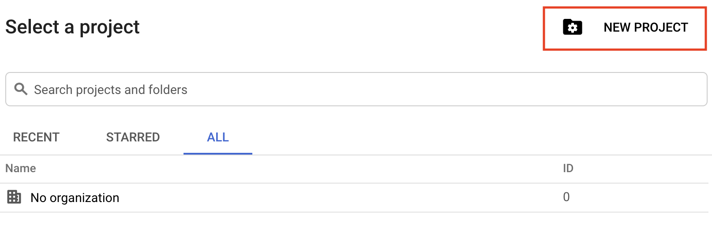

6. On the `New Project` screen, enter a name for your project. **The project name you choose is inconsequential to the application itself**.
    * **Note**: A `Project ID` will be generated based on the project name entered. It does not matter what the name is, but it **cannot** be changed after the project is created.
    * You do not need to change the default `No organization` location .
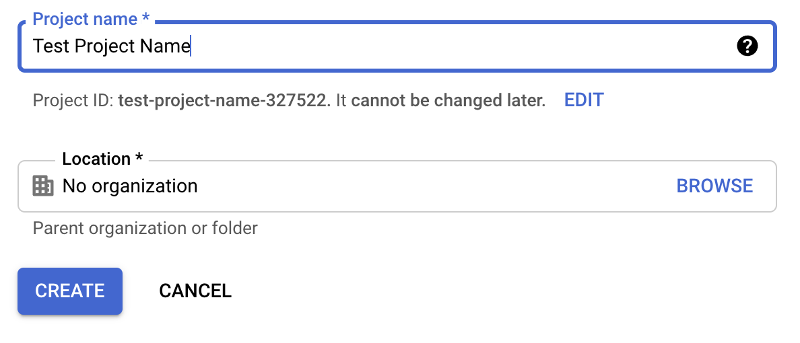

7. Click `Create` to be returned to the `Google Cloud Platform`.
8. A notification should appear near the top-right corner of the screen confirming the creation of your new project. Click `Select Project`.
    * If no notification appears, navigate to the hamburger menu (three horizontal lines) in the top-left corner of the screen. Click `Home` and then `Dashboard`.
9. While on the `Dashboard` screen, click to select your project.

## Generating API Key, OAuth Consent Screen, Client ID & Client Secret, Refresh Token
### API Key
1. From the project dashboard, navigate to the hamburger menu in the top-left corner of the screen. Select `APIs & Services` then select `Library`.
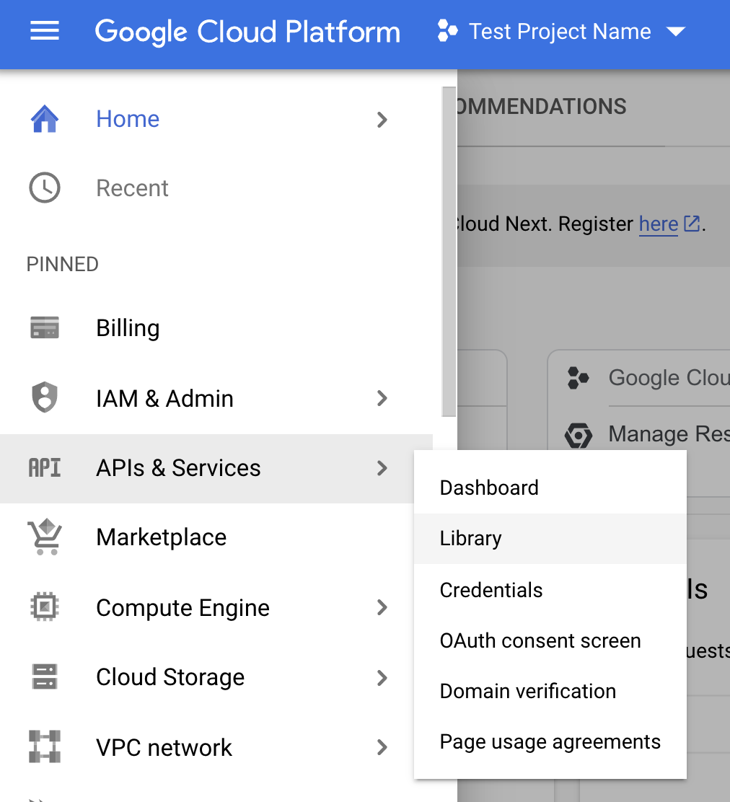

2. Search the word `Calendar` in the `Search for APIs & Services` bar toward the top-center of the screen. 
3. Your first search result should be `Google Calendar API`. Click on this option. 
    * **Note**: You **DO NOT** want the `CalDAV API`, which will be the second option available.

4. On the next screen, click the button marked `Enable`.
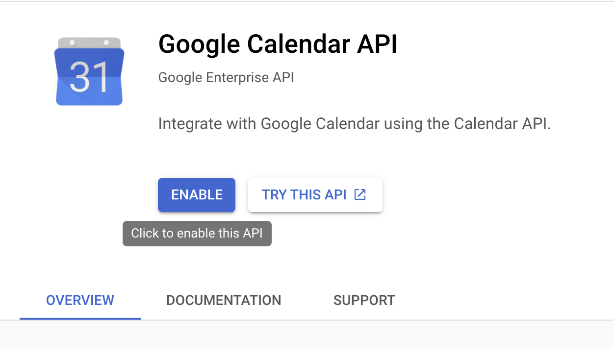

5. After enabling the API, you will be directed to the `Google Calendar API Overview` screen. 
### OAuth Consent Screen
1. Navigate to the hamburger menu again, select `APIs & Services` and then `OAuth consent screen`. Here we will set the options of our Google authorization consent screen. (The menu that grants our application access to a Google account).
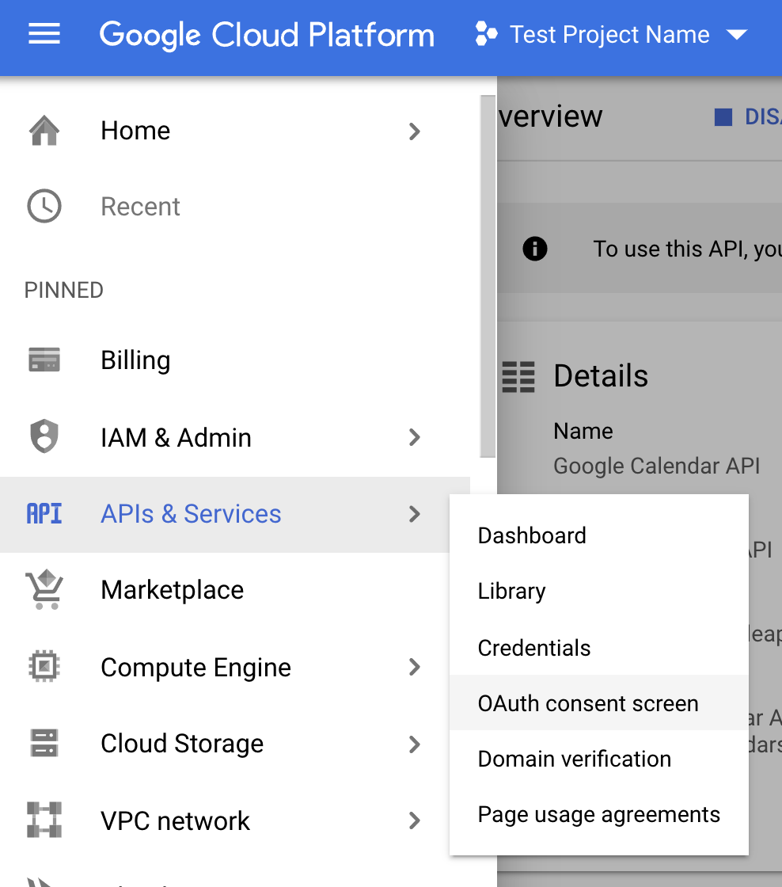

2. On the `OAuth consent screen`, select User Type `External` and click `Create`.
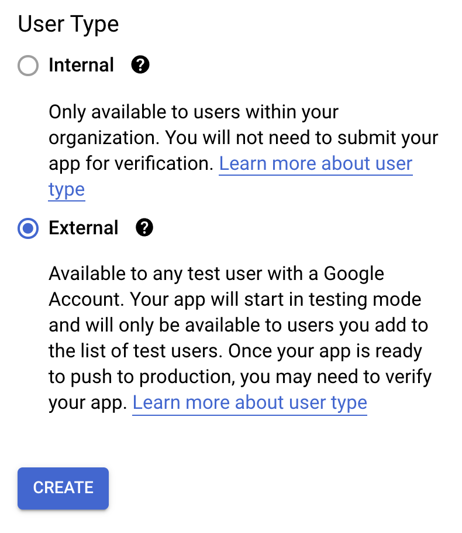

3. On the `Edit app registration` screen, enter the `App Name`, `User support email` & `Developer contact information email`. 
    * **Note**: The `App Name` should be what you wish to be displayed on the OAuth consent screen to notify the user (**SfA Admin User Only**) of the app they are consenting to allow access to their Google account. 
    * The `App Domain` & `App Logo` **should be left blank**. These options would require the application to be subject to the verification process through Google.
4. Click `Save And Continue`.
5. You do not need to do anything on `Step 2` of the `Edit app registration`: `Scopes`. Again, click `Save And Continue`.
6. On `Step 3`: `Test Users`, click the `Add Users` button. 
7. In the `Add Users` pop-up, add the email of the Startups for All account of which the community calendar will be accessed through. 
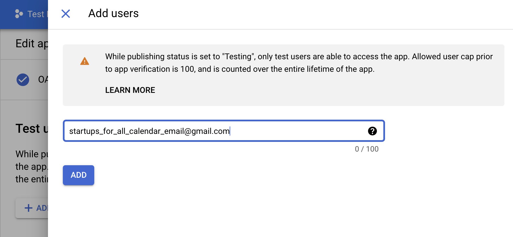

8. Click `Save And Continue`.
9. On the next page, `Step 4`: `Summary`, click `Back To Dashboard`.
### Client ID & Client Secret
1. Navigate to the hamburger menu in the top-left corner of the screen. Select `APIs & Services` and then `Credentials`.
2. Near the top-center of the screen, click `+ Create Credentials`. Select `OAuth client ID` from the drop-down menu. 
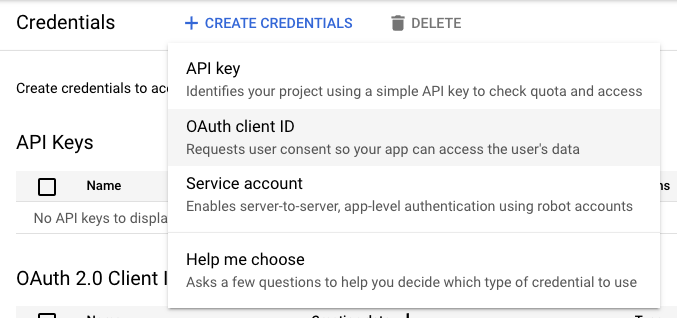

3. Select `Web Application` from the `Application type` drop-down menu.
4. Enter a `Client Name`, or leave the default `Web client 1` in the `Name` option field. 
    * **Note**: The name you choose here is inconsequential to the application itself. This name will only be used to identify the client in the console, it **WILL NOT** be shown to end users.
5. In the `Authorized redirect URIs` section, click the `+ Add URI` button. 
    * Add `https://sfa-community-calendar-client.herokuapp.com/oauth2callback`
        * **Note**: It is essential that the end of the URL does not contain a `/` symbol. The redirect will not work if it is present.
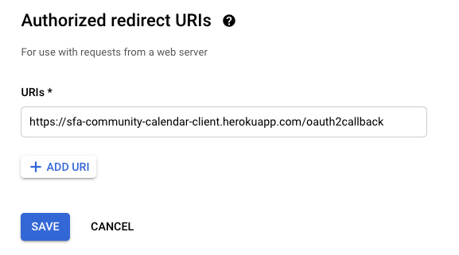

6.  Click `Create`. A pop-up window will appear to confirm the creation of the OAuth client. Click `OK`.
    * **Note**: You can find the client information contained in the confirmation screen in the `Credentials` section of `APIs & Services` at any point after creation.
7. You will be returned to the `APIs & Services` `Credentials`. Your client information will be visible within the `OAuth 2.0 Client IDs` section.
    * To access your `Client ID` & `Client Secret`, click the pencil icon `Edit OAuth client`.
    * Your client information will be visible near the top-right corner of this page.
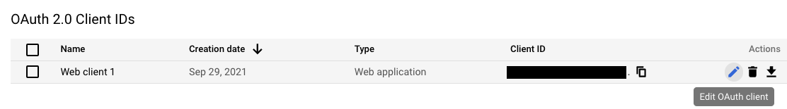

8. Click `+ Create Credentials` near the top-center of the screen and this time select `API key`.
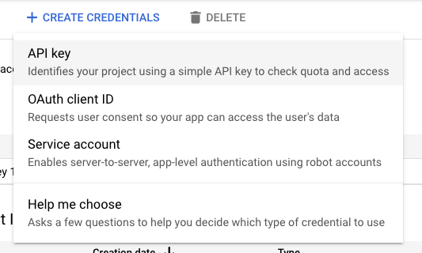

9. A pop-up window will appear to confirm the creation of your API key. Click `Close`.
    * **Note**: You can find the API key information contained in the confirmation screen in the `Credentials` section of `APIs & Services` at any point after creation.
### Change Status of Project From "Testing" to "In Production"
1. Navigate to the hamburger menu in the top-left corner of the screen. Select `APIs & Services` and then `OAuth Consent Screen`.
2. Click `Publish App` in the `Publishing status` section.
    * **Note**: The initial state of the app is `Testing` by default. 
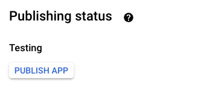

3. Click `Confirm` on the pop-up menu that appears.
4. Your app will now have a status of `In Production`
    * **Note**: You will be able to switch the status back to `Testing` at any time if needed. 
### Generating Google Refresh Token from oAuth2 Playground
1. Visit `https://developers.google.com/oauthplayground/`.
2. Click the `Gear Icon` near the top-right corner of the page.
3. Click the checkbox labeled `Use your own OAuth credentials`
4. Enter your `Client ID` and `Client Secret` in the provided fields. Click `Close`.
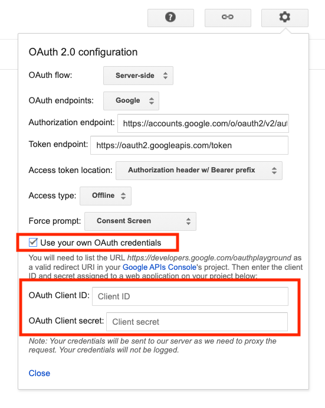

5. In the `Select & authorize APIs` box on the left side of the page, scroll down to `Google Calendar API v3`. Select to open a dropdown menu.
6. Select `https://www.googleapis.com/auth/calendar.events`
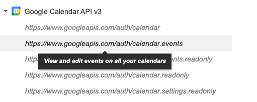

7. Click the `Authorize APIs` button near the bottom of the screen.
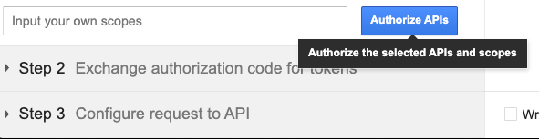

8. A `Google Consent` screen will appear. Choose the SfA Google account associated with the Community Calendar that will be used in the application. 
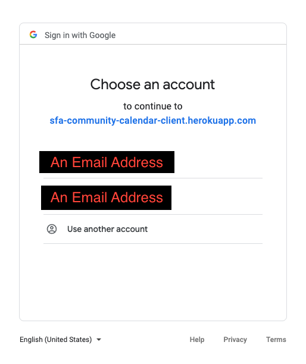

9. A warning will appear to alert you that the application has not been verified by Google. Click `Advanced` and then `Go to {App Name}`
    * **Note**: There may be a second pop-up window to determine the level of access you wish to grant the application. The application will need to `View and edit events on all your calendars`.
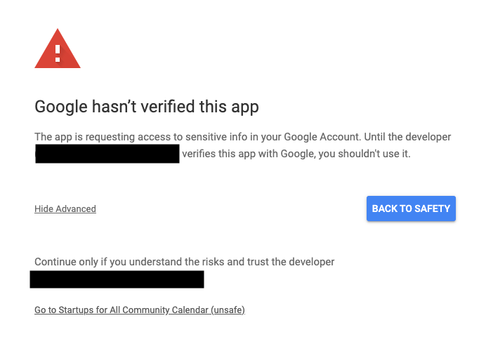

10. After authorization, you will be redirected back to `OAuth 2.0 Playground`. `Step 2` will now be open on the left side of the page. Click the `Exchange authorization code for tokens` button. 
    * **Note**: `Step 2` will close and `Step 3` will open after the click. Return to `Step 2` to see the generated tokens.
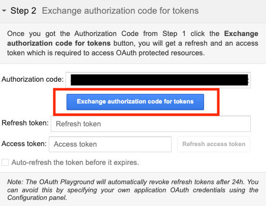

11. The generated `Refresh Token` will be used during the set-up of the Heroku application.
## Adding Google OAuth Information to Heroku App
### Heroku App Set-up
1. In the `sfa-community-calendar-api` Heroku App, navigate to `Settings` in the navigation menu toward the top of the screen.
2. In the `Config Vars` section, click `Reveal Config Vars`. 
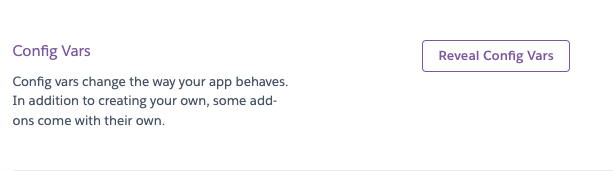

3. Click the pencil icon next to the input field corresponding to `GOOGLE_AUTH_CLIENT_ID`. Enter your `Client ID` in the `Value` field of the pop-up window. Click `Save changes`.
    * 

Client ID?
Refer to <code>Step 7</code> of the <code>Client ID & Client Secret</code> section above for information on where to gather your <code>Client ID</code>.

4. Click the pencil icon next to the input field corresponding to `GOOGLE_AUTH_CLIENT_SECRET`. Enter your `Client Secret` in the `Value` field of the pop-up window. Click `Save changes`.
    * 

Client Secret?
Refer to <code>Step 7</code> of the <code>Client ID & Client Secret</code> section above for information on where to gather your <code>Client Secret</code>.

5. Click the pencil icon next to the input field corresponding to `GOOGLE_AUTH_REFRESH_TOKEN`. Enter your `Refresh Token` in the `Value` field of the pop-up window. Click `Save changes`.
    * 

Refresh Token?
Refer to <code>Generating Google Refresh Token from oAuth2 Playground</code> above for information on where to gather your <code>Refresh Token</code>.

6. Click the pencil icon next to the input field corresponding to `GOOGLE_AUTH_REDIRECT_URL`. Enter `https://sfa-community-calendar-client.herokuapp.com/oauth2callback` in the `Value` field of the pop-up window. Click `Save changes`.
    * **Note**: If the URL entered here does not **exactly** match the redirect URL entered in `Step 5` of the `Client ID & Client Secret` section above, the redirect from Google will not work. 
7. Click the pencil icon next to the input field corresponding to `GOOGLE_AUTH_SCOPES`. Enter `https://www.googleapis.com/auth/calendar.events` in the `Value` field of the pop-up window. Click `Save changes`.
## Calendar ID, OAuth Consent & Refresh Token for Use in Application
### Obtaining Google Calendar ID
1. Visit `calendar.google.com`
2. Sign in using the account associated with the calendar being used in the application.
3. In the section labeled `My calendars`, on the left of the page, hover your mouse over the calendar name. Click the three dots to open an `Options` menu.
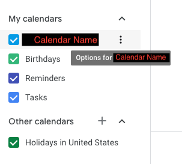

4. Select the option `Settings and Sharing`.
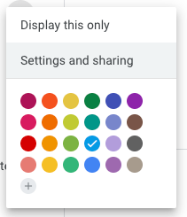

5. Scroll down to the `Integrate Calendar` section. Here you will find your `Calendar ID`.
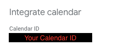

### Calendar In-Application Set-up
1. In the application, navigate to the hamburger menu near the top-right of the screen.
2. Select `Admin` and then select `Admin Login`
3. On the `Admin Login` screen, enter the Admin `username` and `password` and press `Log In`
4. Navigate to the `Admin` link in the navigation bar near the top-left of the screen. 
5. Enter your `Calendar ID` in the provided field.
5. Click the `Authorize GCal` button. You will be redirected to an `OAuth Consent Screen`.
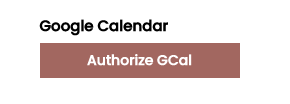

6. Choose the Google account you want to allow Google to access.
    * **Note**: In order to add events to the correct Google calendar, the Google account associated with SfA Community Calendar should be the only account used in this step.

7. You will be redirected to the application. The `Google Refresh Token` that allows the application access to your Google account and your `Calendar ID` will be stored in the database. 
    * **Note**: You should only have to complete this process **one time** during the initialization process. When the application is authorized and the `Calendar ID` is set, it should remain that way. You **do not** need to press the `Authorize GCal` button again unless errors occur involving the Google calendar. 
    * If errors are encountered with Google, The `Google Refresh Token` may be updated at any time, even if the current token is still valid. You can click the `Authorize GCal` button to reauthorize the application and a new token will be saved to the database. 
